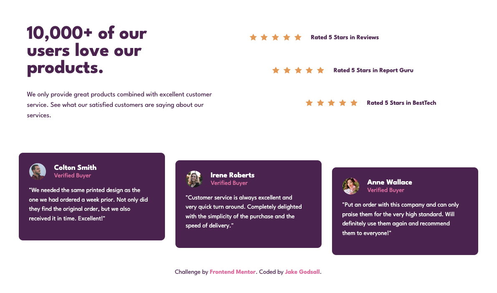

# Social Proof Section (Frontend Mentor)

This is a solution to the [Social proof section challenge on Frontend Mentor](https://www.frontendmentor.io/challenges/social-proof-section-6e0qTv_bA). Frontend Mentor challenges help you improve your coding skills by building realistic projects.

## Overview

### The challenge

Users should be able to:

-   View the optimal layout for the section depending on their device's screen size

### Screenshot

### Links

-   Live Site URL: [Netlify](https://jakegodsall-social-proof-section.netlify.app)

## My process

### Built with

-   Semantic HTML5 markup
-   CSS custom properties
-   Flexbox
-   Mobile-first workflow

### What I learned

-   There was not any specific new features or techniques learned in this project. Rather, it was a greate opportunity to assimilate the things I have learned in previous projects.

### Continued development

-   I shall learn to reach the children of an element in SASS. The way I did so in this project was unwieldy and I believe there is a much better way of doing so.

## Author

-   Website - [Jake Godsall](https://jakegodsall.com)
-   Frontend Mentor - [@jakegodsall](https://www.frontendmentor.io/profile/jakegodsall)
-   LinkedIn - [@godsalljake](https://www.linkedin.com/in/godsalljake/)

### Notes

This project was originally completed on 3rd August 2022.

This repository is part of a series of repositories that have recently been cleaned and updated as part of an overhaul of my GitHub profile. The purpose of this overhaul was to ensure that each repository reflects my current development standards and practices, and to provide a cleaner, more professional appearance.

The project is updated as of 28th December 2023.

## License

This project is open source and available under the [MIT License](https://github.com/jakegodsall/fm-social-proof-section/blob/main/LICENSE).
